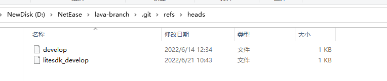

# git HEAD

思考:

一、一个repository一个HEAD？

应该是这样的，因为git使用  `.git/HEAD` 来保存它的值，那么这就表面它的repository级别的。

二、HEAD的默认值是多少？

通过查看 `.git/HEAD` ，下面的我的repository中它的值:

```
ref: refs/heads/litesdk_develop
```

最最简单的解释就是: 它指向的是当前的分支名。那它所引用的是什么呢？看下面的内容:



看了一下，`refs/heads/litesdk_develop` 中的内容其实就是commit hash。

如果要深挖，那么这就涉及一个问题: `refs` 是什么？关于此，可以参见stackoverflow [git: difference between "branchname" and "refs/heads/branchname"](https://stackoverflow.com/questions/1526471/git-difference-between-branchname-and-refs-heads-branchname) 。

## [learning git branching](https://learngitbranching.js.org/?locale=en) # *Detach yo' HEAD*

> NOTE: 
>
> "*Detach yo' HEAD*"的意思是: 分离你的***HEAD*** 。

First we have to talk about "HEAD". HEAD is the **symbolic name** for the currently checked out commit -- it's essentially what commit you're working on top of.

HEAD always points to the most recent commit which is reflected in the working tree. Most git commands which make changes to the working tree will start by changing HEAD.

Normally HEAD points to a branch name (like bugFix). When you commit, the status of bugFix is altered and this change is visible through HEAD.

> NOTE:
>
> 这段话的内容结合 `.git/HEAD` 中的内容是更好的


## stackoverflow [What are the git concepts of HEAD, master, origin?](https://stackoverflow.com/questions/8196544/what-are-the-git-concepts-of-head-master-origin)


## 素材

### stackoverflow [How to get the current branch name in Git?](https://stackoverflow.com/questions/6245570/how-to-get-the-current-branch-name-in-git)

