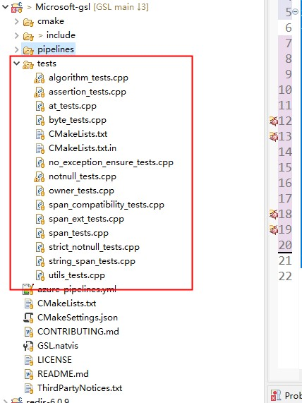

# 如何系统地提升软件质量

> 邓开 2021-04-30

如何快速地交付高质量的软件？如何系统的提升软件质量？考虑:

1、开发人员素质

2、软件开发过程(软件工程领域的概念，"software development process")

3、工具

4、......

## 经验与反思

1、programmer还需要是一个QA(质保)

2、测试没有提缺陷并不代表软件质量好，没有bug

3、一些隐藏的bug，一旦爆发，不仅难以排除，后果可能非常严重（比如C/C++ integer overflow undefined behavior，导致的问题非常诡异，排查起来非常困难，如果经验不丰富，则根本无从查起，需要考虑如何系统性地解决这类问题）

4、需要借助tool来分析程序，找出常见bug

> NOTE: 
>
> 1、tool非常多，合理的使用tool，能够发现潜在的bug

5、规范，避免常见bug


## 案例: [nlohmann](https://github.com/nlohmann)/**[json](https://github.com/nlohmann/json)**

> NOTE: 
>
> 一、25K star，说明它比较流行、成熟
>
> 二、它采用的软件工程方法是比较典型的，值得借鉴；
>
> 

### Serious testing. 

Our class is heavily [unit-tested](https://github.com/nlohmann/json/tree/develop/test/src) and covers [100%](https://coveralls.io/r/nlohmann/json) of the code, including all exceptional behavior. Furthermore, we checked with [Valgrind](https://valgrind.org/) and the [Clang Sanitizers](https://clang.llvm.org/docs/index.html) that there are no memory leaks. [Google OSS-Fuzz](https://github.com/google/oss-fuzz/tree/master/projects/json) additionally runs fuzz tests against all parsers 24/7, effectively executing billions of tests so far. To maintain **high quality**, the project is following the [Core Infrastructure Initiative (CII) best practices](https://bestpractices.coreinfrastructure.org/projects/289).

> NOTE: 
>
> 1、它的做法是非常值得借鉴的
>
> 2、后面会对 [Core Infrastructure Initiative (CII) best practices](https://bestpractices.coreinfrastructure.org/projects/289) 进行说明


### build

> NOTE:
>
> 1、自动化集成、CI (我们有)

[](https://travis-ci.org/nlohmann/json) 

[](https://ci.appveyor.com/project/nlohmann/json) 

[](https://github.com/nlohmann/json/actions?query=workflow%3AUbuntu) 

[](https://github.com/nlohmann/json/actions?query=workflow%3AmacOS) 

[](https://github.com/nlohmann/json/actions?query=workflow%3AWindows) 


### 代码覆盖率

> NOTE:
>
> 1、达到了100%的覆盖率

[](https://coveralls.io/github/nlohmann/json?branch=develop) 

[](https://scan.coverity.com/projects/nlohmann-json) 


### code quality 分析、自动化code review

> NOTE: 
>
> 1、使用了很多code analysis tool

[](https://www.codacy.com/app/nlohmann/json?utm_source=github.com&utm_medium=referral&utm_content=nlohmann/json&utm_campaign=Badge_Grade) 

https://www.codacy.com/product


[](https://lgtm.com/projects/g/nlohmann/json/context:cpp) 

https://lgtm.com/


[](https://bugs.chromium.org/p/oss-fuzz/issues/list?sort=-opened&can=1&q=proj:json) 

https://bugs.chromium.org/p/oss-fuzz/issues/list


### 在线使用

[](https://wandbox.org/permlink/3lCHrFUZANONKv7a) 


### 文档

[](https://nlohmann.github.io/json/doxygen/index.html) 


### CII best practice

[](https://bestpractices.coreinfrastructure.org/projects/289) 


## 最佳实践: [CII Best Practices Badge Program](https://bestpractices.coreinfrastructure.org/en)

The [Linux Foundation (LF)](https://www.linuxfoundation.org/) [Core Infrastructure Initiative (CII)](https://www.coreinfrastructure.org/) Best Practices badge(徽章) is a way for Free/Libre and Open Source Software (FLOSS) projects to show that they follow best practices. 


### [FLOSS Best Practices Criteria (Passing Badge)](https://bestpractices.coreinfrastructure.org/en/criteria/0)

> NOTE: 
>
> 详细的标准。需要对此进行详细介绍

#### Change Control

> NOTE: 
>
> 其实就是版本控制

#### Quality

**Working build system**

**Automated test suite**

**New functionality testing**

**Warning flags**

#### Security

> NOTE: 
>
> 暂时无需考虑

#### Analysis

**Static code analysis**


**Dynamic code analysis**


## 软件开发过程: TDD && BDD

### Test-driven Development(TDD)

#### baike [TDD（测试驱动开发(Test-Driven Development)）# TDD原则](https://baike.baidu.com/item/TDD/9064369?fr=aladdin) 

1、独立测试：

不同代码的测试应该相互独立，一个类对应一个测试类（对于C代码或C++全局函数，则一个文件对应一个测试文件），一个函数对应一个测试函数。

用例也应各自独立，每个用例不能使用其他用例的结果数据，结果也不能依赖于用例执行顺序。 

~~一个角色：开发过程包含多种工作，如：编写测试代码、编写产品代码、代码重构等。做不同的工作时，应专注于当前的角色，不要过多考虑其他方面的细节。~~

> 不理解上面这段话的含义

2、测试列表：

代码的功能点可能很多，并且需求可能是陆续出现的，任何阶段想添加功能时，应把相关功能点加到测试列表中，然后才能继续手头工作，避免疏漏。

3、测试驱动：

即利用测试来驱动开发，是TDD的核心。要实现某个功能，要编写某个类或某个函数，应首先编写测试代码，明确这个类、这个[函数](https://baike.baidu.com/item/函数/18686609)如何使用，如何测试，然后在对其进行设计、编码。

4、先写断言：

编写测试代码时，应该首先编写判断代码功能的断言语句，然后编写必要的辅助语句。

5、可测试性：

产品代码设计、开发时的应尽可能提高可测试性。每个代码单元的功能应该比较单纯，“各家自扫门前雪”，每个类、每个函数应该只做它该做的事，不要弄成大杂烩(**single responsibility principle**)。尤其是增加新功能时，不要为了图一时之便，随便在原有代码中添加功能，对于C++编程，应多考虑使用子类、继承、重载等OO方法(**封装**)。

> NOTE: 
>
> 这段总结地不错

6、及时重构：

对结构不合理，重复等“味道”不好的代码，在测试通过后，应及时进行重构。

7、小步前进：

软件开发是复杂性非常高的工作，小步前进是降低复杂性的好办法。


#### 知乎 [TDD 与 BDD 仅仅是语言描述上的区别么？ - 程序人生的回答](https://www.zhihu.com/question/20161970/answer/1341811526) 

这对于**单元测试**与开发是很有用的一种实践。因为TDD是要求在写代码之前就要想好怎么测，测什么，这解决了**可测性**低的问题。另外，TDD还可以提高代码的**测试覆盖率**，令bug在**编码阶段**就能被发现。减少上线后发现问题，修复问题的指数级增长成本。

> NOTE: 
>
> 非常好的解释了为什么使用TDD。

#### wikipedia [Test-driven Development](http://en.wikipedia.org/wiki/Test-driven_development)

> NOTE: 
>
> 非常权威

Test-driven development (TDD) is a software development process relying on software requirements being converted to test cases before software is fully developed, and tracking all software development by repeatedly testing the software against all test cases. This is opposed to software being developed first and test cases created later.


#### 思考

一、C++中，如何需要编写方便测试的程序？

1、header only library，include what you need。

2、封装、OOP

### Behavior-driven development(BDD)

#### Wikipedia [Behavior-driven development](https://en.wanweibaike.com/wiki-Behavior-driven%20development)

In [software engineering](https://en.wanweibaike.com/wiki-Software_engineering), **behavior-driven development** (**BDD**) is an [agile software development](https://en.wanweibaike.com/wiki-Agile_software_development) process that encourages collaboration among developers, quality assurance testers, and customer representatives in a software project.

> NOTE: 
>
> 一、developers, quality assurance testers, customer representatives 一同进行协作

It encourages teams to use conversation and concrete examples to formalize a shared understanding of how the application should behave.[[4\]](https://en.wanweibaike.com/wiki-Behavior-driven development#cite_note-BDD_in_action-4) It emerged from [test-driven development](https://en.wanweibaike.com/wiki-Test-driven_development) (TDD).

> NOTE: 
>
> 源自TDD，弥补其不足


#### 知乎 [TDD 与 BDD 仅仅是语言描述上的区别么？ - 程序人生的回答](https://www.zhihu.com/question/20161970/answer/1341811526) 

**BDD（ Behaviour-Driven Development)**

他们发现，如果将自然语言按照一些简单语法组织起来，代码将会非常容易解释与处理。使用这种方法可以让非技术人员、客户可以参与到需求的确认与验收当中。

我们看一下两个例子

```text
Scenario: Refunded items should be returned to stock
  Given a customer bought a black sweater from me
    and I have three black sweaters left in stock.
   When he returns the sweater for a refund
   then I should have four black sweaters in stock.


场景： 微信聊天
假如  手机安装了微信
当  用户打开微信
那么  手机会出现用户的微信聊天界面
```

以上就是BDD使用的叫做Gherkin的语言，它的理念是使用自然语言来描述功能，而且强调的是使用例子来说明需求功能。是不是跟敏捷开发中的用户故事(User Story)很像？嗯，因为它们都是一个妈生的。

其实只要我们回顾一下敏捷宣言，就会发现，逼弟弟干的事就是解决个体之间互动与客户协作这两个问题。

**BDD的需求研讨会(Specification Workshops)**

那么，我们使用这种语言，把需求一个个用例子列出来，客户/产品、开发、测试三方一起讨论与确认。

> NOTE: 
>
> 三方可以同时进行协作，使用一种三方都能够理解的DSL


#### baike [行为驱动开发](https://baike.baidu.com/item/%E8%A1%8C%E4%B8%BA%E9%A9%B1%E5%8A%A8%E5%BC%80%E5%8F%91/9424963?fromtitle=BDD&fromid=10735732&fr=aladdin)


#### software [Cucumber](https://cucumber.io/)

这个软件将BDD从理论带入了工程实践中。


### See also

zhihu [TDD 与 BDD 仅仅是语言描述上的区别么？](https://www.zhihu.com/question/20161970)


## Code coverage

### What is code coverage

zhihu [什么是代码覆盖率？](https://www.zhihu.com/question/22244568)

> 是软件测试中的一种度量，描述程序中源代码被测试的比例和程度，所得比例称为**代码覆盖率**。在做**单元测试**时，代码覆盖率常常被拿来作为衡量测试好坏的指标，甚至，用代码覆盖率来考核测试任务完成情况，比如，代码覆盖率必须达到80％或 90％。


zhihu [实际软件工程中是否真的需要100%代码覆盖率（code coverage）？](https://www.zhihu.com/question/29528349) # [ThoughtWorks中国](https://www.zhihu.com/question/29528349/answer/236076742) 

> 代码覆盖率高不能说明代码质量高，但是反过来看，代码覆盖率低，代码质量绝对不会高到哪里去，可以作为测试自我审视的重要工具之一。


**语句覆盖、判定覆盖、条件覆盖、条件判定组合覆盖、多条件覆盖和路径覆盖**

> NOTE: 
>
> 1、需要介绍上述各种指标


### Code coverage的意义

> 代码覆盖率高不能说明代码质量高，但是反过来看，代码覆盖率低，代码质量绝对不会高到哪里去，可以作为测试自我审视的重要工具之一。

量化的方式、比较科学；


### 如何生成代码覆盖率？

1、rdc.hundsun [如何用Gcov优雅地实现代码覆盖率可视化报告?](https://rdc.hundsun.com/portal/article/704.html)

2、csdn [Linux下c/c++项目代码覆盖率的产生方法](https://blog.csdn.net/zm_21/article/details/37820257)

3、csdn [温故而知新：gtest单元测试工具和lcov覆盖率统计工具的结合使用](https://blog.csdn.net/u010312436/article/details/53940309)

注意:

1、需要进行特殊的编译


## 单元测试

### 工具

|                                                              | 优势                                                         |
| ------------------------------------------------------------ | ------------------------------------------------------------ |
| [Catch2](https://github.com/catchorg/Catch2/blob/master/docs/tutorial.md#top) | header only library、无外部依赖、多范式测试框架，可用于单元测试、TDD 和 BDD |
| [Googletest](https://google.github.io/googletest/)           | 功能全面，比较流行                                           |

### xUnit framework

基本上所有的单元测试库(包括JUnit、PyUnit)，都是参考的这个框架，了解了这个框架，基本上就入门了所有的单元测试库。

#### wikipedia [xUnit](https://en.wikipedia.org/wiki/XUnit) # xUnit architecture

> NOTE: architecture这对于我们掌握unit testing framework非常重要；xUnit的architecture是非常经典的。
>

All xUnit frameworks share the following basic component architecture, with some varied implementation details.[[1\]](https://en.wikipedia.org/wiki/XUnit#cite_note-1)

##### Test runner

A [test runner](https://en.wikipedia.org/w/index.php?title=Test_runner&action=edit&redlink=1) is an executable program that runs tests implemented using an **xUnit** framework and reports the test results.[[2\]](https://en.wikipedia.org/wiki/XUnit#cite_note-2)

##### Test case

A [test case](https://en.wikipedia.org/wiki/Test_case) is the most elemental class. All unit tests are inherited from here.

##### Test fixtures

> NOTE: "fixture"在此的含义是"装配"，在下面使用的是context，显然context的含义是更加准确的。
>
> 为什么"return to the original state after the tests"？
>
> 因为要执行多个test，"return to the original state"能够保证后续的test能够继续执行。
>
> 在后面的"test execution"章节将对它有更好的描述。

A [test fixture](https://en.wikipedia.org/wiki/Test_fixture) (also known as a test context) is the set of [preconditions](https://en.wikipedia.org/wiki/Precondition) or state needed to run a test. The developer should set up a known good state before the tests, and return to the original state after the tests.

##### Test suites

A [test suite](https://en.wikipedia.org/wiki/Test_suite) is a set of tests that all share the same fixture. The order of the tests shouldn't matter.

##### Test execution

The execution of an individual unit test proceeds as follows:

```C++
setup(); /* First, we should prepare our 'world' to make an isolated environment for testing */
...
/* Body of test - Here we make all the tests */
...
teardown(); /* At the end, whether we succeed or fail, we should clean up our 'world' to 
not disturb other tests or code */
```

The `setup()` and `teardown()` methods serve to initialize and clean up **test fixtures**.

> NOTE:
>
> `setup()`
>
> `teardown()`

##### Test result formatter

A [test runner](https://en.wikipedia.org/w/index.php?title=Test_runner&action=edit&redlink=1) produces results in one or more output formats. In addition to a plain, human-readable format, there is often a test result formatter that produces [XML](https://en.wikipedia.org/wiki/XML) output.

##### Assertions

An [assertion](https://en.wikipedia.org/wiki/Assertion_(computing)) is a function or macro that verifies the behavior (or the state) of the unit under test. Usually an assertion expresses a [logical condition](https://en.wikipedia.org/wiki/Logical_conditional) that is true for results expected in a correctly running [system under test](https://en.wikipedia.org/wiki/System_under_test) (SUT). Failure of an assertion typically throws an [exception](https://en.wikipedia.org/wiki/Exception_handling), aborting the execution of the current test.

### [Googletest](https://google.github.io/googletest/) 

http://google.github.io/googletest/

在其官网上，有详细的文档说明。

### [Googletest Primer](http://google.github.io/googletest/primer.html)


#### Basic Concepts

> NOTE: 
>
> 简单介绍这些概念，和xUnit对应

| 概念           | 解释 |                                                              |
| -------------- | ---- | ------------------------------------------------------------ |
| *assertions*   |      | [Assertions Reference](http://google.github.io/googletest/reference/assertions.html) |
| *Tests*        |      |                                                              |
| *test suite*   |      |                                                              |
| *test fixture* |      |                                                              |
| *test program* |      |                                                              |


#### Assertions

`ASSERT_*` versions generate fatal failures when they fail, and **abort the current function**. 

`EXPECT_*` versions generate nonfatal failures, which don’t abort the current function.

```C++
ASSERT_EQ(x.size(), y.size()) << "Vectors x and y are of unequal length";

for (int i = 0; i < x.size(); ++i) {
  EXPECT_EQ(x[i], y[i]) << "Vectors x and y differ at index " << i;
}
```

#### Simple Tests

一个*test*的基本格式

```C++
TEST(TestSuiteName, TestName) {
  ... test body ...
}
```

For example, let’s take a simple integer function:

```c++
int Factorial(int n);  // Returns the factorial of n
```

A test suite for this function might look like:

```c++
// Tests factorial of 0.
TEST(FactorialTest, HandlesZeroInput) {
  EXPECT_EQ(Factorial(0), 1);
}

// Tests factorial of positive numbers.
TEST(FactorialTest, HandlesPositiveInput) {
  EXPECT_EQ(Factorial(1), 1);
  EXPECT_EQ(Factorial(2), 2);
  EXPECT_EQ(Factorial(3), 6);
  EXPECT_EQ(Factorial(8), 40320);
}
```

googletest groups the test results by test suites, so logically related tests should be in the same test suite; 


#### Test Fixtures: Using the Same Data Configuration for Multiple Tests

If you find yourself writing two or more tests that operate on similar data, you can use a *test fixture*. This allows you to reuse the same configuration of objects for several different tests.

> NOTE: 
>
> 多个test使用相同的"Data Configuration"

```c++
TEST_F(TestFixtureName, TestName) {
  ... test body ...
}
```

As an example, let’s write tests for a FIFO queue class named `Queue`, which has the following interface:

```C++
template <typename E>  // E is the element type.
class Queue {
 public:
  Queue();
  void Enqueue(const E& element);
  E* Dequeue();  // Returns NULL if the queue is empty.
  size_t size() const;
  ...
};
```


```c++
class QueueTest : public ::testing::Test {
 protected:
  void SetUp() override {
     q1_.Enqueue(1);
     q2_.Enqueue(2);
     q2_.Enqueue(3);
  }

  // void TearDown() override {}

  Queue<int> q0_;
  Queue<int> q1_;
  Queue<int> q2_;
};
```


```C++
TEST_F(QueueTest, IsEmptyInitially) {
  EXPECT_EQ(q0_.size(), 0);
}

TEST_F(QueueTest, DequeueWorks) {
  int* n = q0_.Dequeue();
  EXPECT_EQ(n, nullptr);

  n = q1_.Dequeue();
  ASSERT_NE(n, nullptr);
  EXPECT_EQ(*n, 1);
  EXPECT_EQ(q1_.size(), 0);
  delete n;

  n = q2_.Dequeue();
  ASSERT_NE(n, nullptr);
  EXPECT_EQ(*n, 2);
  EXPECT_EQ(q2_.size(), 1);
  delete n;
}
```

When these tests run, the following happens:

1. googletest constructs a `QueueTest` object (let’s call it `t1`).
2. `t1.SetUp()` initializes `t1`.
3. The first test (`IsEmptyInitially`) runs on `t1`.
4. `t1.TearDown()` cleans up after the test finishes.
5. `t1` is destructed.
6. The above steps are repeated on another `QueueTest` object, this time running the `DequeueWorks` test.


#### Invoking the Tests

```c++
#include "this/package/foo.h"

#include "gtest/gtest.h"

namespace my {
namespace project {
namespace {

// The fixture for testing class Foo.
class FooTest : public ::testing::Test {
 protected:
  // You can remove any or all of the following functions if their bodies would
  // be empty.

  FooTest() {
     // You can do set-up work for each test here.
  }

  ~FooTest() override {
     // You can do clean-up work that doesn't throw exceptions here.
  }

  // If the constructor and destructor are not enough for setting up
  // and cleaning up each test, you can define the following methods:

  void SetUp() override {
     // Code here will be called immediately after the constructor (right
     // before each test).
  }

  void TearDown() override {
     // Code here will be called immediately after each test (right
     // before the destructor).
  }

  // Class members declared here can be used by all tests in the test suite
  // for Foo.
};

// Tests that the Foo::Bar() method does Abc.
TEST_F(FooTest, MethodBarDoesAbc) {
  const std::string input_filepath = "this/package/testdata/myinputfile.dat";
  const std::string output_filepath = "this/package/testdata/myoutputfile.dat";
  Foo f;
  EXPECT_EQ(f.Bar(input_filepath, output_filepath), 0);
}

// Tests that Foo does Xyz.
TEST_F(FooTest, DoesXyz) {
  // Exercises the Xyz feature of Foo.
}

}  // namespace
}  // namespace project
}  // namespace my

int main(int argc, char **argv) {
  ::testing::InitGoogleTest(&argc, argv);
  return RUN_ALL_TESTS();
}
```


### [Advanced googletest Topics](http://google.github.io/googletest/advanced.html)

This document will show you more assertions as well as how to construct complex failure messages, propagate fatal failures, reuse and speed up your test fixtures, and use various flags with your tests.

#### More Assertions

> NOTE: 
>
> 直接看 [Assertions Reference](http://google.github.io/googletest/reference/assertions.html)

#### Teaching googletest How to Print Your Values

> NOTE: 
>
> overload `<<` 来让输出更加友好

```c++
#include <ostream>

namespace foo {

class Bar {  // We want googletest to be able to print instances of this.
...
  // Create a free inline friend function.
  friend std::ostream& operator<<(std::ostream& os, const Bar& bar) {
    return os << bar.DebugString();  // whatever needed to print bar to os
  }
};

// If you can't declare the function in the class it's important that the
// << operator is defined in the SAME namespace that defines Bar.  C++'s look-up
// rules rely on that.
std::ostream& operator<<(std::ostream& os, const Bar& bar) {
  return os << bar.DebugString();  // whatever needed to print bar to os
}

}  // namespace foo
```

#### Death Tests

#### Sharing Resources Between Tests in the Same Test Suite

#### Global Set-Up and Tear-Down

#### Value-Parameterized Tests


#### Testing Private Code


#### Extending googletest by Handling Test Events


#### Sanitizer Integration

> NOTE: 
>
> 这是符合最佳实践的

### [googletest Assertions Reference](http://google.github.io/googletest/reference/assertions.html)

All assertion macros support streaming a custom failure message into them with the `<<` operator, for example:

```c++
EXPECT_TRUE(my_condition) << "My condition is not true";
```

#### Explicit Success and Failure

```c++
switch(expression) {
  case 1:
    ... some checks ...
  case 2:
    ... some other checks ...
  default:
    FAIL() << "We shouldn't get here.";
}
```

#### Generalized Assertion

The following assertion allows [matchers](http://google.github.io/googletest/reference/matchers.html) to be used to verify values.

> NOTE: 
>
> 需要使用到 [matcher](http://google.github.io/googletest/reference/matchers.html) 

```C++
#include "gmock/gmock.h"

using ::testing::AllOf;
using ::testing::Gt;
using ::testing::Lt;
using ::testing::MatchesRegex;
using ::testing::StartsWith;

...
EXPECT_THAT(value1, StartsWith("Hello"));
EXPECT_THAT(value2, MatchesRegex("Line \\d+"));
ASSERT_THAT(value3, AllOf(Gt(5), Lt(10)));
```

#### Boolean Conditions

```
EXPECT_TRUE(condition)
ASSERT_TRUE(condition)
```

Verifies that *`condition`* is true.


```
EXPECT_FALSE(condition)
ASSERT_FALSE(condition)
```

Verifies that *`condition`* is false.


#### Binary Comparison

`EXPECT_NE`

```
EXPECT_EQ(val1,val2)
ASSERT_EQ(val1,val2)
```

Verifies that *`val1`*`==`*`val2`*.

`EXPECT_LT`

Verifies that *`val1`*`<`*`val2`*.

#### String Comparison

#### Floating-Point Comparison

#### Exception Assertions

The following assertions verify that a piece of code throws, or does not throw, an exception. Usage requires exceptions to be enabled in the build environment.

```c++
EXPECT_NO_THROW({
  int n = 5;
  DoSomething(&n);
});
```

#### Death Assertions

The following assertions verify that a piece of code causes the process to terminate. For context, see [Death Tests](http://google.github.io/googletest/advanced.html#death-tests).

### [googletest Matchers Reference](http://google.github.io/googletest/reference/matchers.html)

> NOTE: 
>
> 其实相当于overload `==`

| Macro                                | Description                                                  |
| :----------------------------------- | :----------------------------------------------------------- |
| `EXPECT_THAT(actual_value, matcher)` | Asserts that `actual_value` matches `matcher`.               |
| `ASSERT_THAT(actual_value, matcher)` | The same as `EXPECT_THAT(actual_value, matcher)`, except that it generates a **fatal** failure. |


### 案例: 

下面结合具体的例子来说明Googletest的使用；

[microsoft](https://github.com/microsoft)/**[GSL](https://github.com/microsoft/GSL)**




### 如何实践

1、尽可能地实现所有的测试用例全自动化地执行，生成报告（通过率、覆盖率）

2、开发需要自己递交测试用例、测试程序

3、严格的warning、使用多种static code analysis tool

4、自动部署环境

5、测试用例编写（除了基本的功能测试，还需要测试 极端值、异常）；

6、最佳实践 rigtorp [C++ Best Practices](https://rigtorp.se/cpp-best-practices/) :

> Build and run your tests with [sanitizers](https://github.com/google/sanitizers) enabled.


## 思考讨论

1、测试程序 和 源程序 如何放？


## Analysis Tools

下面是一些程序分析工具。

### static code analysis

商业付费的:

Sonar 

开源免费的: 

[Clang-Tidy](https://clang.llvm.org/extra/clang-tidy/#id1)[¶](https://clang.llvm.org/extra/clang-tidy/#clang-tidy)

[Clang Static Analyzer](https://clang.llvm.org/docs/ClangStaticAnalyzer.html)

Clang Thread Safety Analysis[¶](https://clang.llvm.org/docs/ThreadSafetyAnalysis.html#thread-safety-analysis)

### dynamic code analysis

一、[Valgrind](https://valgrind.org/) 

二、[Clang Sanitizers](https://clang.llvm.org/docs/index.html) :

1、MemorySanitizer[¶](https://clang.llvm.org/docs/MemorySanitizer.html#memorysanitizer)

2、UndefinedBehaviorSanitizer[¶](https://clang.llvm.org/docs/UndefinedBehaviorSanitizer.html#undefinedbehaviorsanitizer)

3、LeakSanitizer[¶](https://clang.llvm.org/docs/LeakSanitizer.html#leaksanitizer)

> NOTE: 
>
> 能够发现大多数问题


