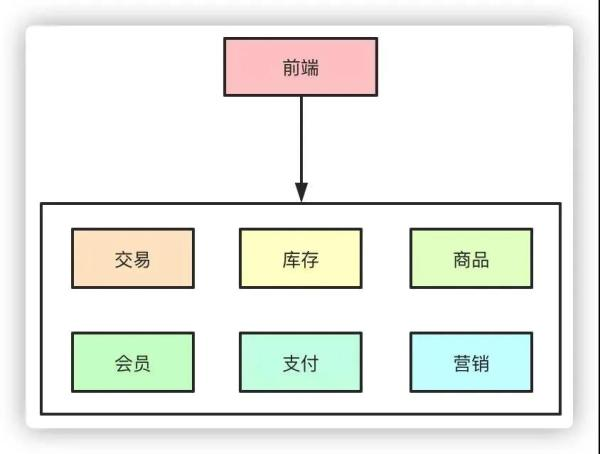
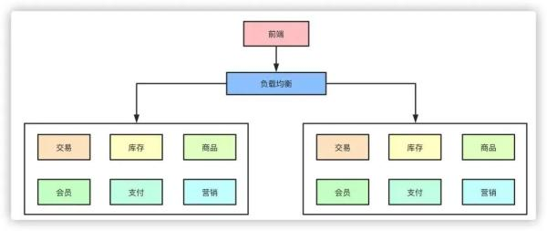
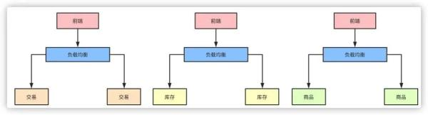

# Microservice

## What are Microservices?

关于这个问题，在 developer.51cto [打工人，支撑亿级高并发的系统长啥样?](https://developer.51cto.com/art/202011/630464.htm)  "# 微服务架构演化 "中给出了非常好的解释，我是通过这篇文章的描述才深刻认识microservice的。

### developer.51cto [打工人，支撑亿级高并发的系统长啥样?](https://developer.51cto.com/art/202011/630464.htm) # 微服务架构演化

在互联网早期的时候，单体架构就足以支撑起日常的业务需求，大家的所有业务服务都在一个项目里，部署在一台物理机器上。

所有的业务包括你的交易系统、会员信息、库存、商品等等都夹杂在一起，当流量一旦起来之后，单体架构的问题就暴露出来了，机器挂了所有的业务全部无法使用了。

> NOTE: single-point failure

于是，集群架构的架构开始出现，单机无法抗住的压力，最简单的办法就是水平拓展横向扩容了，这样，通过负载均衡把压力流量分摊到不同的机器上，暂时是解决了单点导致服务不可用的问题。

但是随着业务的发展，在一个项目里维护所有的业务场景使开发和代码维护变得越来越困难，一个简单的需求改动都需要发布整个服务，代码的合并冲突也会变得越来越频繁，同时线上故障出现的可能性越大。微服务的架构模式就诞生了。

把每个独立的业务拆分开独立部署，开发和维护的成本降低，集群能承受的压力也提高了，再也不会出现一个小小的改动点需要牵一发而动全身了。

以上的点从高并发的角度而言，似乎都可以归类为通过服务拆分和集群物理机器的扩展提高了整体的系统抗压能力，那么，随之拆分而带来的问题也就是高并发系统需要解决的问题。

---

在下面的两个网站中对此进行了深入分析: 

## amazon [Microservices](https://aws.amazon.com/microservices/)

Microservices are an architectural and organizational approach to software development where software is composed of small independent services that communicate over well-defined APIs. These services are owned by small, self-contained teams.

Microservices architectures make applications easier to scale and faster to develop, enabling innovation and accelerating time-to-market for new features.

### Monolithic vs. Microservices Architecture

### Characteristics of Microservices

#### Autonomous

#### Specialized

### Benefits of Microservices

#### Agility

#### Flexible Scaling

#### Easy Deployment

#### Technological Freedom

#### Reusable Code

#### Resilience

## [microservices.io](https://microservices.io/ )

